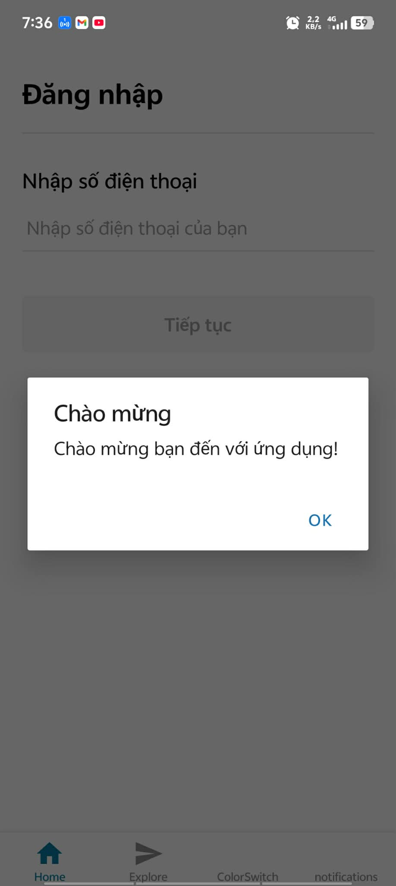
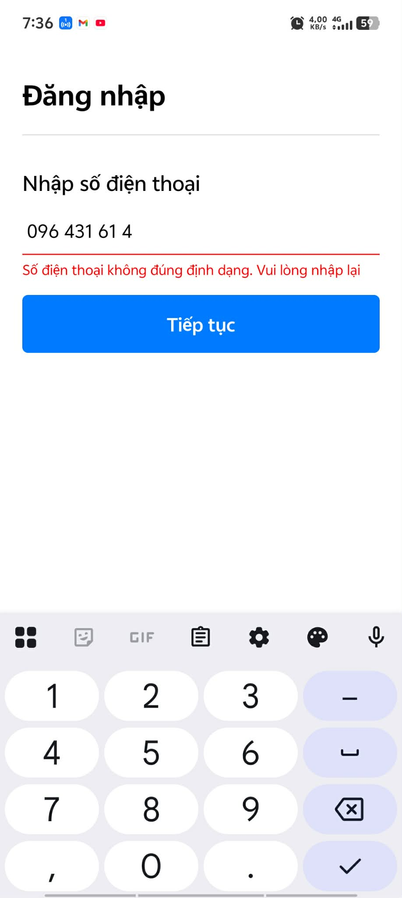
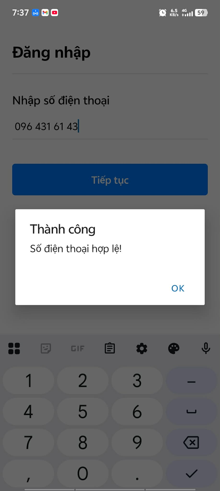

# Bài tập Buổi 6 - TextInput nâng cao & useEffect

## Thông tin sinh viên
- **Họ và tên:** Trần Đại Hiệp
- **Mã sinh viên:** 21810310632

## Mô tả
Thực hành các kỹ thuật nâng cao với State và Hook:
- Sử dụng `useState` để xử lý validation realtime khi nhập và khi click submit.
- Tự động format Auto-spacing cho số điện thoại (XXX XXX XX XX).
- Sử dụng hook `useEffect` để kích hoạt Alert chào mừng chỉ 1 lần duy nhất khi khởi chạy ứng dụng.
## Demo

  