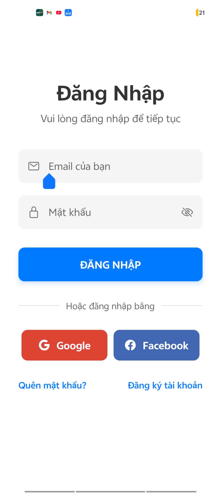
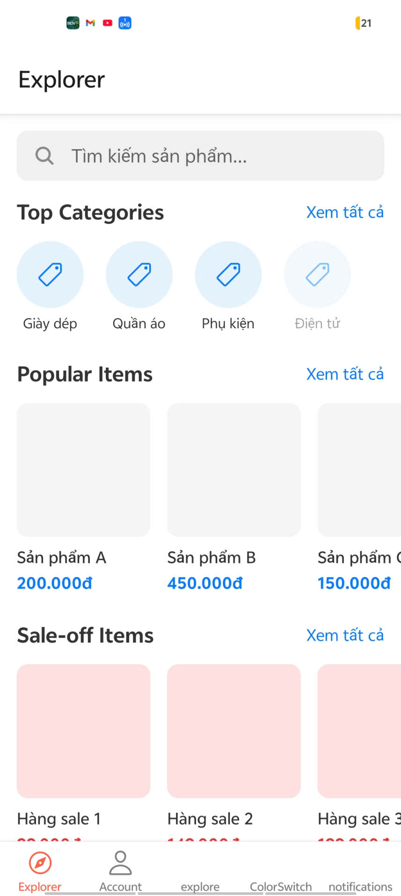
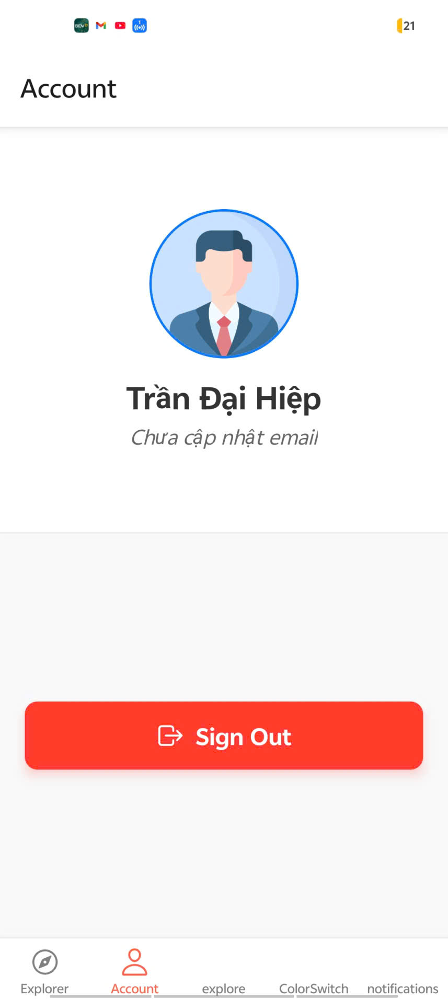

# Bài tập Buổi 9 - Hoàn thiện ứng dụng (Stack + Bottom Tabs + Context)

## Thông tin sinh viên
- **Họ và tên:** Trần Đại Hiệp
- **Mã sinh viên:** 21810310632

## Yêu cầu bài toán đã hoàn thành
1. **Luồng Navigation:**
   - **Auth Stack:** Gồm màn hình Đăng nhập (SignIn) với giao diện nhập Email/Password hiện đại và nút Social Login (Google/Facebook).
   - **Main Stack:** Gồm thanh điều hướng Bottom Tabs với 2 màn hình là Explorer (Home) và Account (Profile).
2. **Quản lý trạng thái (Context API & AsyncStorage):**
   - Khởi tạo `AppContext` lưu trữ trạng thái `isLoggedIn` và `userEmail`.
   - Tích hợp `AsyncStorage` để duy trì phiên đăng nhập offline (tự động vào Home khi mở lại app).
   - Xây dựng Auth Guard tại file Layout gốc để tự động điều hướng người dùng.
3. **Giao diện Component-Driven:**
   - **Màn hình Explorer:** Được chia làm 4 group rõ ràng (Search, Categories, Popular, Sale-off). Áp dụng tư duy tái sử dụng code bằng component `SectionBlock` (chứa Header và FlatList).
   - **Màn hình Account:** Hiển thị Avatar, đồng bộ Email người dùng đã nhập từ màn SignIn thông qua Context, tích hợp nút Sign Out để xóa bộ nhớ.

## Hình ảnh Demo
  

 