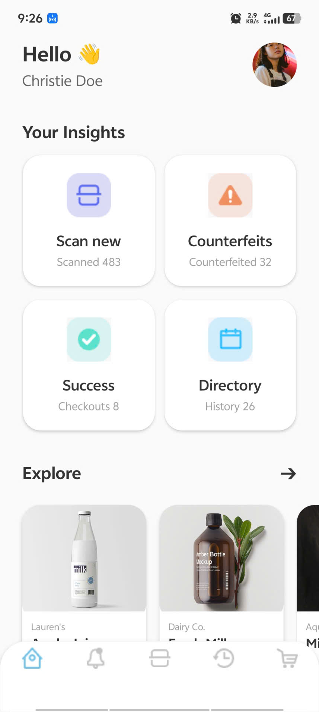
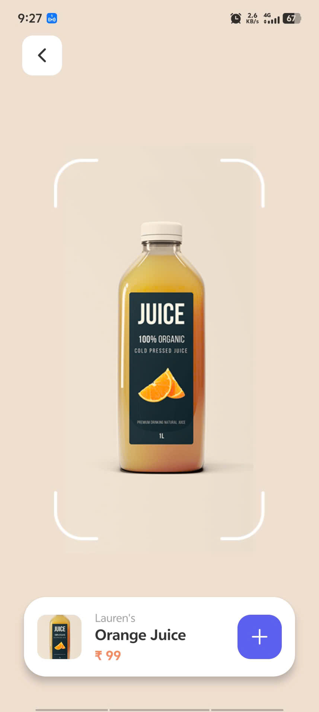
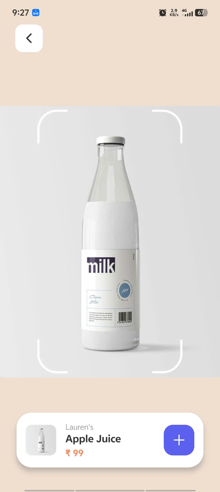
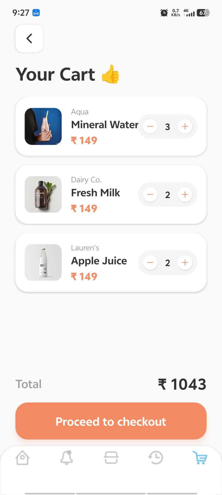

## Thông tin sinh viên
- **Họ và tên:** Trần Đại Hiệp
- **Mã sinh viên:** 21810310632

## Các tính năng đã hoàn thiện
1. **Thiết kế Giao diện (UI/UX) chuẩn Figma:**
   - Xây dựng 3 màn hình chính: `Home`, `Scan`, và `Cart` sử dụng các assets hình ảnh và icon nội bộ (Local Images) đúng theo bản thiết kế.
   - Thanh điều hướng **Bottom Tabs** được custom giao diện (bo góc, ẩn label, icon tự đổi màu) với nút Scan ở giữa được thiết kế nổi bật.
2. **Luồng Điều hướng (Navigation):**
   - Ứng dụng **Expo Router** để xử lý mượt mà luồng chuyển trang (Stack & Tabs).
   - Truyền tham số động (Pass Parameters) từ màn hình Home sang màn hình Scan để hiển thị đúng Tên, Hình ảnh và Giá của từng sản phẩm được chọn.
3. **Quản lý Trạng thái & Dữ liệu (State Management):**
   - Sử dụng **Context API** để quản lý giỏ hàng toàn cục.
   - Tích hợp **AsyncStorage** giúp lưu trữ giỏ hàng offline (không bị mất dữ liệu khi tắt app).
   - Logic giỏ hàng thông minh: Tự động cộng dồn số lượng (+1) nếu sản phẩm đã tồn tại, hiển thị Toast Notification mượt mà, tính tổng tiền tự động và có màn hình "Empty State" khi giỏ hàng trống.

## Hình ảnh Demo

 
 
 