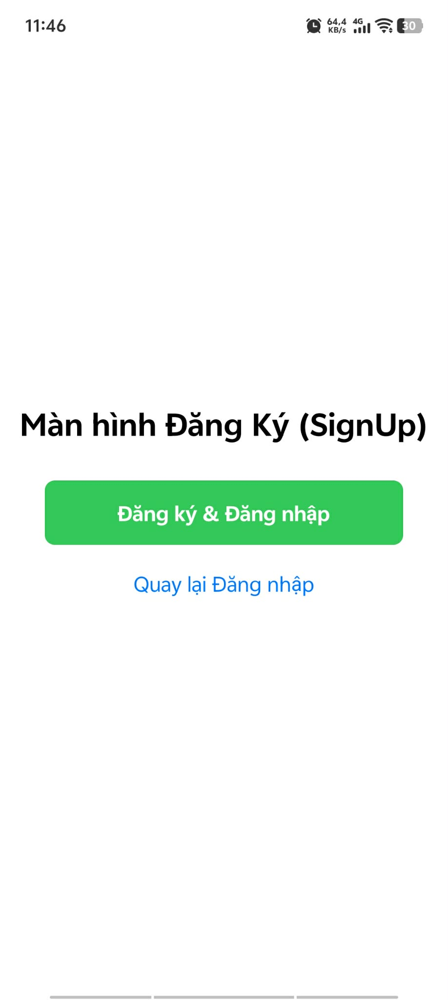
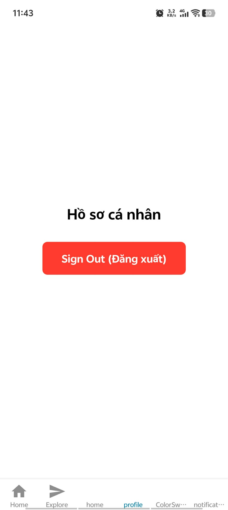
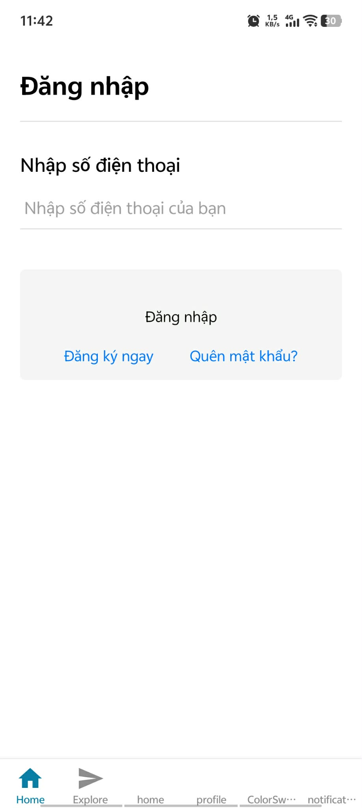

# Bài tập Buổi 8 - Context API & Auth Flow

## Thông tin sinh viên
- **Họ và tên:** Trần Đại Hiệp
- **Mã sinh viên:** 21810310632

## Mô tả
Hoàn thiện luồng đăng nhập sử dụng Context API:
- Quản lý state toàn cục `isLoggedIn` bằng `useContext`.
- Xây dựng cơ chế Auth Guard tại Layout gốc để tự động điều hướng:
  - **Auth Stack:** Gồm SignIn, SignUp, ForgotPassword.
  - **Main Stack:** Gồm Bottom Tabs (Home, Profile).
- Khi SignIn/SignUp thành công -> Cập nhật `isLoggedIn = true` -> Tự động chuyển vào Main Stack.
- Khi bấm Sign Out tại Profile -> Cập nhật `isLoggedIn = false` -> Tự động đẩy ra Auth Stack.

## Demo

