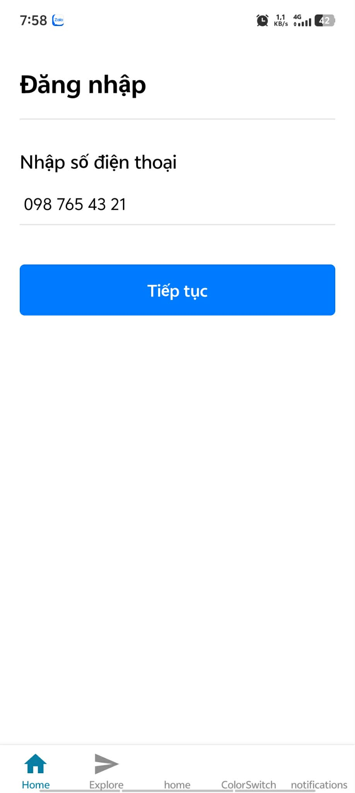

# Bài tập Buổi 7 - React Navigation (Expo Router)

## Thông tin sinh viên
- **Họ và tên:** Trần Đại Hiệp
- **Mã sinh viên:** 21810310632

## Mô tả
Áp dụng cơ chế điều hướng Navigation để nâng cấp màn hình Đăng nhập: 
Xử lý logic khi người dùng nhập số điện thoại hợp lệ thì tự động điều hướng từ SignInScreen sang HomeScreen.

## Demo

