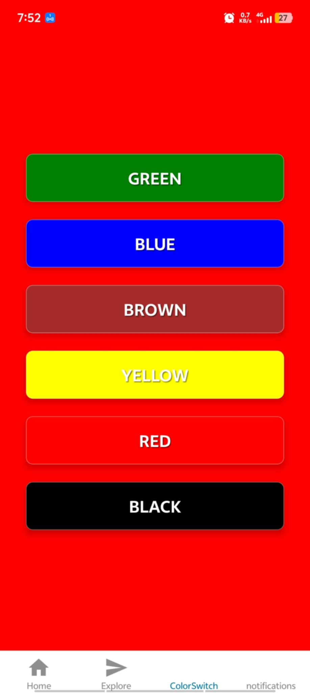
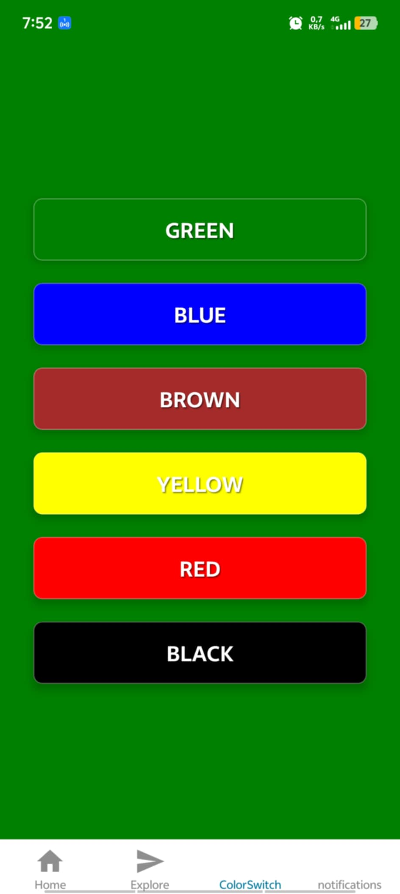

# Bài tập Buổi 5 - React Native Props, Callback & State

## Thông tin sinh viên
- **Họ và tên:** Trần Đại Hiệp
- **Mã sinh viên:** 21810310632

## Mô tả
Thực hành xây dựng ứng dụng đổi màu nền:
1. Sử dụng **Props** và **Callback** để tạo Custom Component `ColorButton` có thể tái sử dụng.
2. Sử dụng hook `useState` trong Component cha để quản lý trạng thái màu nền.
3. Cập nhật màu nền của toàn bộ ứng dụng dựa vào nút bấm được chọn.
## Demo

